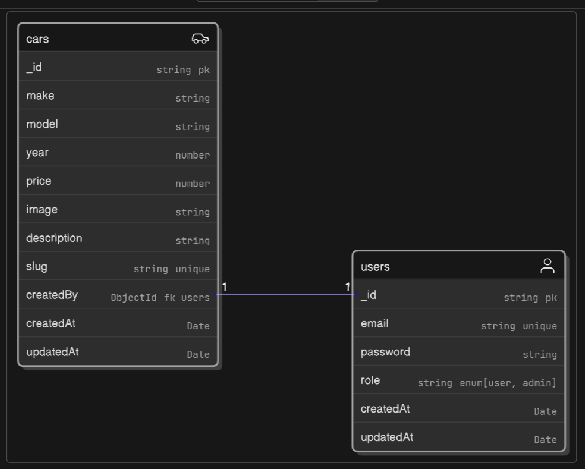

# Car Shop


Welcome to Car Shop, your one-stop destination for finding the perfect car. This project is a full-stack web application built with a modern technology stack, featuring a React-based frontend and a robust Node.js backend.

## ✨ Features

-   **User Authentication:** Secure user login and registration system.
-   **Car Listings:** View a comprehensive list of available cars with detailed information.
-   **Search and Filter:** Easily search for cars and filter them based on various criteria.
-   **Admin Panel:** A dedicated panel for administrators to manage car listings (add, update, delete).
-   **Responsive Design:** A user-friendly interface that works seamlessly on all devices.

## 🚀 Project Walkthrough


## 🛠️ Tech Stack

**Frontend:**

-   [Next.js](https://nextjs.org/) - React framework for building user interfaces.
-   [React](https://reactjs.org/) - A JavaScript library for building user interfaces.
-   [Tailwind CSS](https://tailwindcss.com/) - A utility-first CSS framework for rapid UI development.
-   [Axios](https://axios-http.com/) - Promise-based HTTP client for the browser and Node.js.
-   [Next-Themes](https://github.com/pacocoursey/next-themes) - An abstraction for themes in Next.js.

**Backend:**

-   [Node.js](https://nodejs.org/) - A JavaScript runtime built on Chrome's V8 JavaScript engine.
-   [Express.js](https://expressjs.com/) - A minimal and flexible Node.js web application framework.
-   [MongoDB](https://www.mongodb.com/) - A NoSQL database for storing application data.
-   [Mongoose](https://mongoosejs.com/) - An elegant MongoDB object modeling tool for Node.js.
-   [JWT](https://jwt.io/) - JSON Web Tokens for secure user authentication.
-   [Zod](https://zod.dev/) - A TypeScript-first schema declaration and validation library.

## 📝 API Documentation

The API is documented using Swagger UI. You can access the interactive API documentation to test the endpoints directly in your browser.

-   **API Docs:** [https://car-shopv2.vercel.app/api-docs#/](https://car-shopv2.vercel.app/api-docs#/)

## ER Diagram



## API Endpoints

### Auth Routes

- `POST /api/v1/auth/login` - User login.
- `POST /api/v1/auth/refresh-token` - Refresh access token.
- `POST /api/v1/auth/logout` - User logout.
- `POST /api/v1/auth/me` - Get current user details.

### Car Routes

- `GET /api/v1/cars` - Get all cars.
- `GET /api/v1/cars/search` - Search for cars.
- `GET /api/v1/car/:id` - Get a car by its ID.
- `POST /api/v1/car` - Add a new car (Admin only).
- `PUT /api/v1/car/:id` - Update a car by its ID (Admin only).
- `DELETE /api/v1/car/:id` - Delete a car by its ID (Admin only).

## 🏁 Getting Started

To get a local copy up and running, follow these simple steps.

### Prerequisites

-   [Node.js](https://nodejs.org/en/download/) (v22.x or later)
-   [MongoDB](https://www.mongodb.com/try/download/community)

### Backend Setup

1.  **Clone the repository:**

    ```bash
    git clone https://github.com/your-username/car-shop.git
    cd car-shop/backend
    ```

2.  **Install dependencies:**

    ```bash
    npm install
    ```

3.  **Set up environment variables:**

    Create a `.env` file in the `backend` directory and add the following variables. You can use the `.env.sample` file as a reference.

    ```env
    PORT=
    CORS_ORIGIN=
    MONGO_URI=
    JWT_SECRET=
    NODE_ENV=
    ```

4.  **Seed the database (optional):**

    To populate the database with initial data, run the following command:

    ```bash
    npm run seed
    ```

5.  **Start the development server:**

    ```bash
    npm run dev
    ```

### Frontend Setup

1.  **Navigate to the frontend directory:**

    ```bash
    cd ../frontend
    ```

2.  **Install dependencies:**

    ```bash
    npm install
    ```

3.  **Set up environment variables:**

    Create a `.env` file in the `frontend` directory and add the following variable. You can use the `.env.sample` file as a reference.

    ```env
    NEXT_PUBLIC_API_URL=
    ```

4.  **Start the development server:**

    ```bash
    npm run dev
    ```

## 📜 Available Scripts

### Backend

-   `npm test`: Run tests.
-   `npm start`: Start the production server.
-   `npm run dev`: Start the development server with Nodemon.
-   `npm run lint`: Lint the codebase.
-   `npm run lint:fix`: Fix linting errors.
-   `npm run format`: Format the code with Prettier.
-   `npm run format:check`: Check for formatting errors.
-   `npm run seed`: Seed the database with initial data.

### Frontend

-   `npm run dev`: Start the development server.
-   `npm run build`: Build the application for production.
-   `npm run start`: Start the production server.
-   `npm run lint`: Lint the codebase.
-   `npm run lint-fix`: Fix linting errors.

## 📄 License

This project is licensed under the ISC License. See the `LICENSE` file for more details.